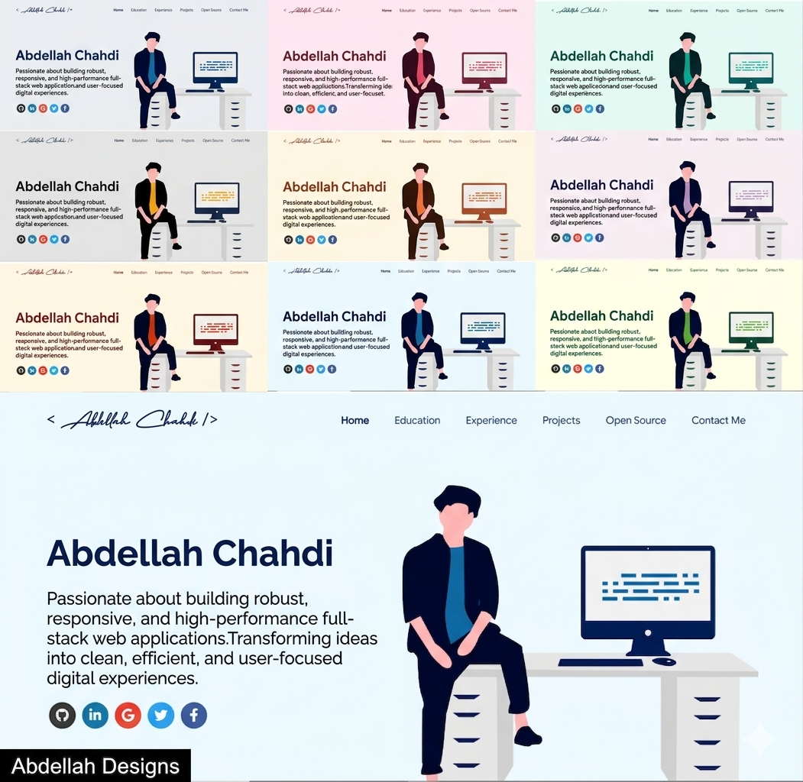

<p align="center"> 
    </img>
</p>

<h1 align="center"> Abdellah Chahdi — Developer Portfolio 🔥 </h1> 
<h3 align="center"> A clean, beautiful, responsive, and fully customized portfolio <br /> built by a Full Stack Developer from Morocco 🇲🇦 </h3>

<p align="center">
  <a href="https://nodejs.org/en/blog/release/v20.11.1"></a>
  <a href="https://www.npmjs.com/package/npm/v/10.2.4"></a>
  <a href="https://reactjs.org/"></a>
  <a href="https://github.com/prettier/prettier"></a>
  <a href="http://badges.mit-license.org/"></a>
  <a href="https://img.shields.io/badge/price-free-ff69b4"></a>
</p>

<p align="center">
  <a href="https://github.com/ABDELLAH-03" target="_blank">
    </img>
  </a>
</p>

---

# About Me 👨‍💻

Hi, I'm **Abdellah Chahdi**, a passionate Full Stack Developer from **Rabat, Morocco**.  
I love building robust, responsive, and high-performance web applications — transforming ideas into clean, efficient, and user-focused digital experiences.

- 🎓 Licence Professionnelle en Développement Informatique — **ISMAGI AGDAL** (2025–2026)
- 🎓 Diplôme Technicien Spécialisé en Développement Digital — **ISTA NTIC** (2021–2023)
- 💼 Full Stack Developer Intern — **Ministère de l'Énergie, des Mines et de l'Environnement**
- 📧 abdellah.chahdi.03@gmail.com
- 🔗 [GitHub](https://github.com/ABDELLAH-03) • [LinkedIn](https://www.linkedin.com/in/abdellah-chahdi-98ab6a267/)

---

# Sections 📚

✔️ Summary and About Me  
✔️ Skills  
✔️ Open Source Projects connected with GitHub  
✔️ Experience  
✔️ Certifications 🏆  
✔️ Education  
✔️ Contact Me  
✔️ Resume Viewer

---

# Tech Stack 🛠️

### Frontend


### Backend


### Mobile


### Database & Cloud


---

# Getting Started 📋

Make sure you have `node >= 20.11.1` and `npm >= 10.2.4` installed.

```bash
# Clone the repository
git clone https://github.com/ABDELLAH-03/masterPortfolio

# Navigate into the project
cd masterPortfolio

# Install dependencies
npm install

# Start the development server
npm start
```

---

# Deployment 📦

This portfolio is deployed using **GitHub Pages**.

```bash
# Build and deploy
npm run deploy
```

Then go to your repository **Settings → Pages** and select the `gh-pages` branch.

Your portfolio will be live at:  
👉 `https://ABDELLAH-03.github.io/masterPortfolio`

---

# Certifications 🏆

| Certificate                                                | Issuer                |
| ---------------------------------------------------------- | --------------------- |
| Introduction to HTML, CSS & JavaScript                     | IBM                   |
| Machine Learning                                           | Stanford / Coursera   |
| Application Security for Developers and DevOps             | IBM                   |
| Deep Learning                                              | DeepLearning.AI       |
| Introduction to Containers, Docker, Kubernetes & OpenShift | IBM                   |
| Object-Oriented Design                                     | University of Alberta |
| Introduction to Cloud Computing                            | IBM                   |
| UI/UX Design                                               | Orange                |
| Blockchain Basics                                          | University at Buffalo |
| Career Management                                          | IBM                   |
| MongoDB                                                    | Orange                |
| AI Fundamentals                                            | IBM                   |

---

# License 📄

This project is licensed under the MIT License - see the [LICENSE](./LICENSE) file for details.
